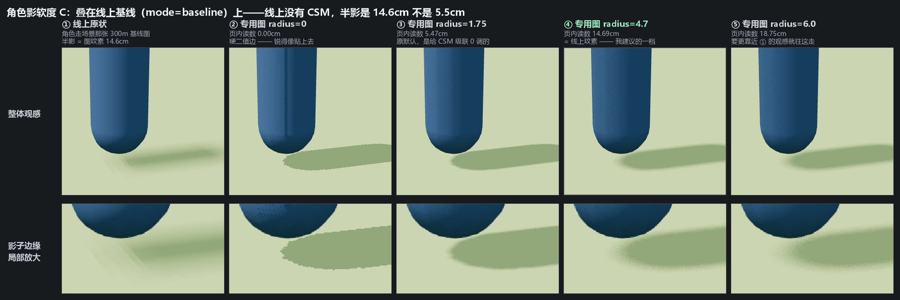

# 角色专用阴影图（character-shadow）

为 openworld 客户端做的**角色高精度阴影**模块：给角色单独一张小阴影图，
再把它乘回接收阴影的材质上，解决"角色在主阴影图里太小、影子又淡又不匀"的问题。

- **接入** → [INTEGRATION.md](INTEGRATION.md)（5 处钩子，其中 3 处各一行）
- **出问题** → [DEBUGGING.md](DEBUGGING.md)（症状 → 原因对照表）
- **要复核数据** → [VERIFICATION.md](VERIFICATION.md)（所有读数的原始记录 + 复现命令）

---

## 一、解决什么问题

角色在主阴影图里**只占约 34 个纹素**（阴影盒 300 m / 贴图 2048² = 14.6 cm 一个纹素，
角色肩宽约 0.5 m）。后果：

| | 主阴影图（原状） | 专用图 |
| --- | --- | --- |
| 影内深度 | 21.3 %（影尖那段只有 15.8 %） | 25.3 %，均匀 |
| 影子面积 | 基准 | **大 41 %** |
| 半影 | 14.6 cm，但和本影被一起平均掉了 | 14.6 cm（对齐后，见下） |

「又淡又不匀」不是错觉：34 个纹素里本影和半影混在一起，采样出来就是一团渐变的灰。
专用图给角色**周围 4 m × 4 m、256² = 1.56 cm 一个纹素**的一张图。



上图左起：原状、专用图四种软度。每一列的过渡宽度都是着色器里按采样足迹算出来的，不是估的。

**换上去影子会明显更"实"**，这是预期内的观感变化，不是 bug。

### 顺带修掉的一个问题：夜间街灯下的「无光之影」

注入点 `lights_fragment_end` 里的 `reflectedLight.directDiffuse` 是**所有直射光之和**，
第一版写成 `directDiffuse *= cs` 就把**点光/聚光**的份额也一起乘掉了。
夜里街灯（`PointLight`，强度很高、且**不投影**）才是画面上唯一的强直射光：
那块地上月光那一份会被场景阴影图正常扣掉（可忽略），而街灯那份光
**没有任何阴影图去挡它** —— 于是这个乘子成了唯一在减它的东西：

```
夜里实测（同一 URL，只换乘子写法的等价变形）：
  旧语义  (非平行光 + 平行光) × cs ：受影响 23987 px，深核 4086 px
                                   深核里只剩 28% 的光（启用均值 63 / 停用 230）
  本  版  非平行光 + 平行光 × cs   ：受影响 0 px，深核无
症状是「本该亮着的地面被压暗」，不是「多了一块影子」——
画面里找不到任何影子能解释这块黑斑。
```

现在注入的是 `非平行光份额 + 平行光份额 × cs`，只乘平行光。白天街灯全灭 ⇒
非平行光份额恰好为 0 ⇒ 与旧写法**逐位相同**（`0.0 + x == x` 在浮点下精确成立，
实测白天四个读数一个字都不差）。完整 A/B 表见 [VERIFICATION.md](VERIFICATION.md) 第一节。

---

## 二、目录

```
README.md          你正在看的
INTEGRATION.md     接入：5 处钩子、软度怎么定、接完必须看的读数、公开 API 一览
DEBUGGING.md       症状 → 原因对照表；哪些还没验证过
VERIFICATION.md    A/B 数据、回归读数、自检结果、复现命令

src/lighting/shadow/
  CharacterShadow.js           算法本体：建图、专用相机、着色器注入（765 行）
  CharacterShadowAdapter.js    接入层：什么时候画、哪些东西进来、挂宿主哪些钩子（349 行）
                               ★ 要 new 的是这个，不要直接用 CharacterShadow

selfcheck/
  adapter-check.html           自检页（开发者工具，**不要**接进产品 build 入口）
  adapter-check.js             43 条断言 + 一个最小宿主（地面 + 方盒当角色 + 一盏平行光）
  package.json / vite.config.js  把这个自检单独打成离线单页用（不影响仓库根的 CLI）

images/char-shadow-softness-alignment.png
```

**`src/lighting/shadow/` 里两个文件就是模块本体**，只依赖 `three` 和彼此，没有别的依赖，
整份拷进你们的 `src/lighting/shadow/` 即可。注释里提到的「宿主」指接入它的那个渲染器。

---

## 三、先跑自检

```bash
cd selfcheck
npm i
npm run build && npm run preview
# 浏览器打开终端给出的地址
```

必须看到最后一行 **`合计 43 通过 / 0 失败`**。有 FAIL 就把那一行原文发出来。
自检自带一个最小宿主，覆盖最容易**静默出错**的那几条：流式新材质补注入、
换角色复用 RT、XR 守卫、以及注入出来的 GLSL 的形状。

---

## 四、接之前必须知道的三件事

1. **three 版本钉在 r180。** 算法靠替换 `ShaderChunk.lights_fragment_begin` 和
   `lights_fragment_end` 实现，这两个 chunk 的**光照顺序**（先点光、再聚光、
   最后平行光）是 r180 的形状。而且 r181+ 删掉了 `PCFSoftShadowMap`，
   级联那边也改过 —— 升级 three 是牵动全局的动作，不是这个模块自己的事。
   升之前先跑自检的**最后 4 条断言**（它们直接对着注入后的 GLSL 源码查形状）。

2. **`radius` 必须和场景阴影图的半影对齐。** 半影 = 场景阴影图的**纹素边长**
   （平行光的 `PCFSoftShadowMap` 只在一个纹素宽上重建，`shadow.radius` 在那个分支
   不生效），所以没有"正确值"，只有"叠在哪个方案上"：

   | 叠在 | 周围影子的半影 | 该用 `radius` | 实测过渡 |
   | --- | --- | --- | --- |
   | 单张基线图（2048² 罩 300 m） | 14.6 cm | **4.7** | 14.69 cm |
   | CSM 级联 0（2048² 罩 114 m） | 5.5 cm | 1.75 | 5.47 cm |

   换你们的配置时按 `radius ≈ 场景半影 / 专用图纹素边长(1.56 cm)` 算。

3. **算法行为在开发测试台里钉得很死，但没有真实客户端上的第一手数据。**
   性能、多人、VR 三条都还没有真机数据，见 [DEBUGGING.md](DEBUGGING.md) 最后一节。
   **别把测试台的读数当成真机性能承诺。**
